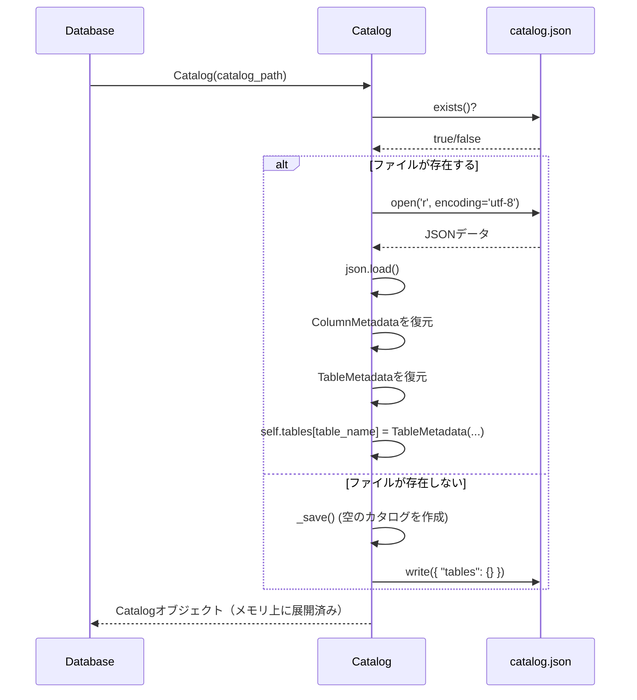
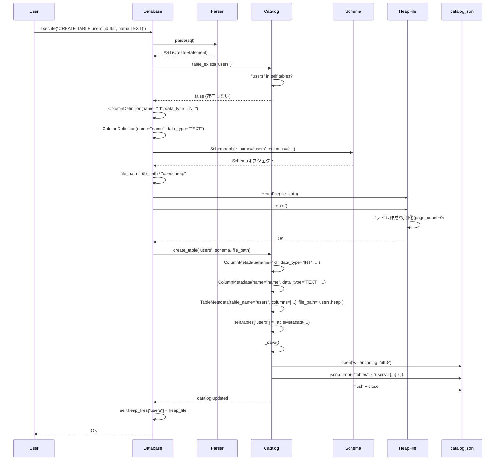
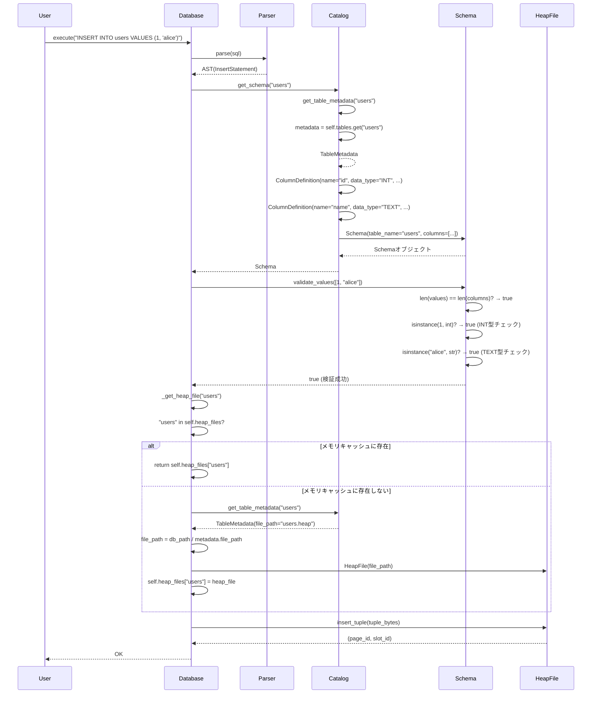
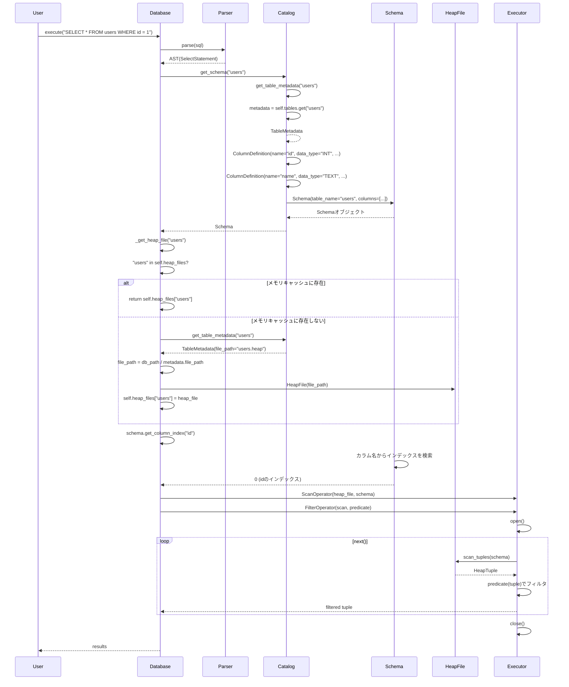
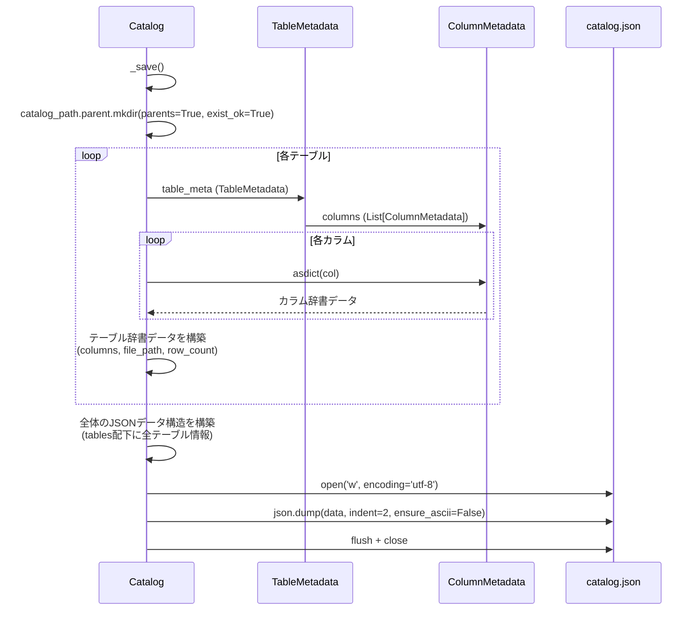
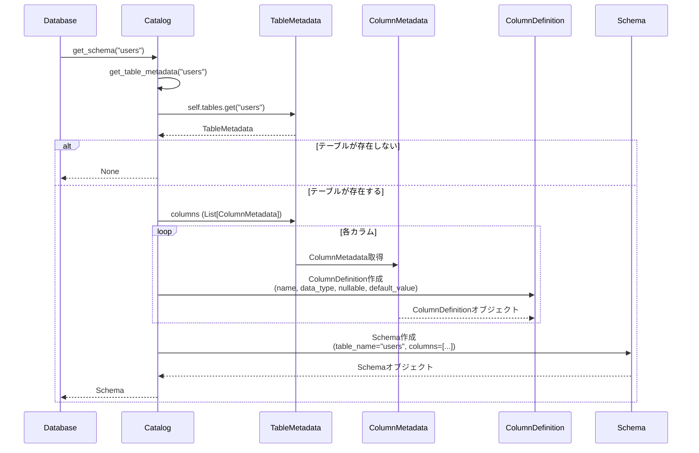

# フェーズ1: テーブル管理 詳細シーケンス図（create → insert → select）

本稿ではテーブル管理層を中心に、CREATE/INSERT/SELECT の詳細な呼び出し関係を時系列で示す。
主役は `Catalog`, `Schema`, `Database` であり、必要に応じて `Parser`, `HeapFile` を登場させる。

---

## 0. データベース起動時のカタログ読み込み

目的: データベースを起動する際、カタログファイルから既存のテーブル情報を読み込む。

要点:
- 起動時にカタログファイルを読み込み、メモリ上に展開することで、高速な名前解決が可能になる。
- カタログファイルが存在しない場合は、空のカタログを作成する。

---

## 1. CREATE TABLE（テーブル作成）

目的: カタログ登録とヒープファイルの物理作成。スキーマの生成から永続化まで。

要点:
- パーサから取得したカラム定義を`ColumnDefinition`に変換し、`Schema`オブジェクトを作成。
- カタログに登録する際、`Schema`の`ColumnDefinition`を`ColumnMetadata`に変換して保存。
- カタログファイル（JSON）への書き込みは、`create_table()`内で`_save()`を呼び出して行う。
- ヒープファイルをメモリキャッシュに追加することで、次回アクセス時のパフォーマンスが向上。

---

## 2. INSERT（スキーマ検証と名前解決）

目的: カタログからスキーマを取得し、値の検証を行ってからストレージ層に挿入。

要点:
- `get_schema()`は、カタログの`TableMetadata`から`Schema`オブジェクトを復元する。
- `ColumnMetadata`を`ColumnDefinition`に変換して`Schema`を作成する。
- スキーマ検証では、値の数、型、NULL値の許可などをチェックする。
- ヒープファイルの取得は、メモリキャッシュを優先し、なければカタログから情報を取得して作成する。

---

## 3. SELECT（スキーマ取得と名前解決）

目的: カタログからスキーマを取得し、名前解決を行ってから実行エンジンに渡す。

要点:
- SELECT操作でも、INSERTと同様にカタログからスキーマを取得する。
- WHERE句のカラム名解決は、`schema.get_column_index()`で行う。
- 実行エンジンには、スキーマ情報とヒープファイルの両方を渡す。

---

## 4. カタログの永続化（_save()の詳細）

目的: メモリ上のカタログ情報をJSONファイルに書き込む。

要点:
- `TableMetadata`を`asdict()`で辞書に変換し、JSON形式で保存する。
- `ensure_ascii=False`により、日本語などの非ASCII文字も正しく保存される。
- `indent=2`により、人間が読みやすい形式で保存される。

---

## 5. スキーマの復元（get_schema()の詳細）

目的: カタログの`TableMetadata`から`Schema`オブジェクトを復元する。

要点:
- `ColumnMetadata`（カタログ用）を`ColumnDefinition`（スキーマ用）に変換する。
- 両者は同じ情報を持つが、用途が異なる（カタログは永続化、スキーマは実行時検証）。

---

## 付記: 役割分担の復習

- **Catalog**: メタデータの永続化と名前解決。JSONファイルへの読み書きを担当。
- **Schema**: テーブル構造の定義と値の検証。実行時に使用される。
- **Database**: カタログとストレージ層を橋渡し。テーブル作成、名前解決、スキーマ検証を統合的に管理。
- **TableMetadata**: カタログに保存されるテーブル情報（永続化用）。
- **ColumnMetadata**: カタログに保存されるカラム情報（永続化用）。
- **ColumnDefinition**: スキーマで使用されるカラム定義（実行時用）。

この分業により、「メタデータの永続化」と「実行時のスキーマ検証」を分離し、それぞれの責務を明確にできる。将来的にシステムカタログテーブルに移行する際も、この分離により影響範囲を最小限に抑えられる。

