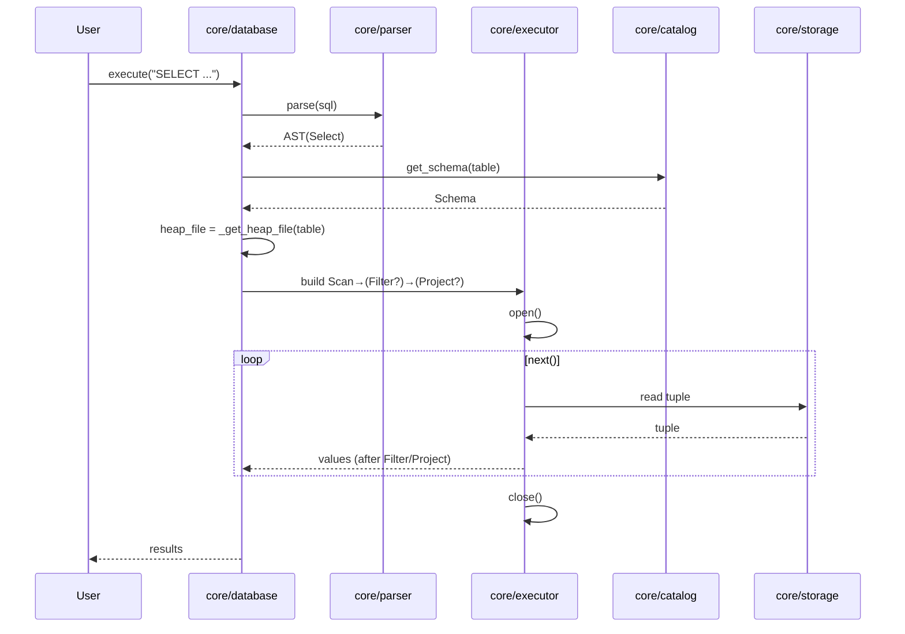
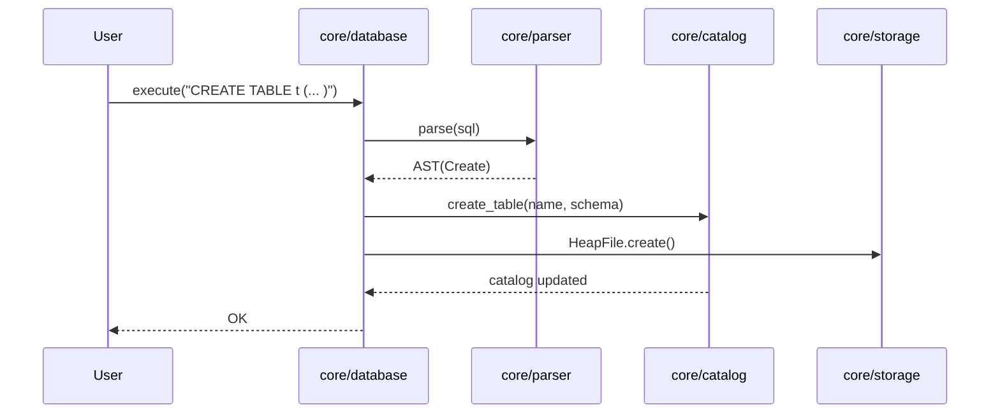
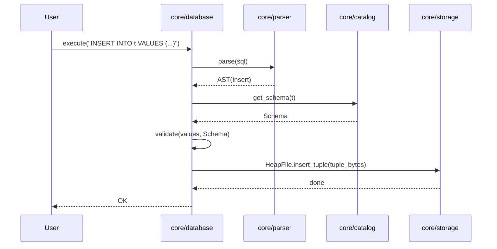

# フェーズ1：シーケンス図で全体像をみる（導入）

## はじめに

やあ、修行中の若きエンジニアよ。古の老賢者です。  
フェーズ1で我らが作るのは、「しゃべれる」だけではない、ちゃんと「動く」小さな関係データベース。その全体像を、言葉だけで追うのは骨が折れる。だから今日は、CREATE / INSERT / SELECT の3つの代表シナリオを、シーケンス図で「流れ」として眺めることにしよう。

## なぜシーケンス図か

- 目の前のコード（`core/`配下）で起きている呼び出しの順序が、一目でわかる  
- 「どの層がどこで責任を持つか」を、線ではなく“時系列”で理解できる  
- 将来の拡張（WAL、インデックス、トランザクション）を差し込む位置が見える  

歴史の余談を添えるなら、RDBの世界は常に「層」の発明の歴史だ。Parser、Executor、Catalog、Storageという分業は、巨大化するシステムを人間が制御するための知恵。シーケンス図は、その知恵の“会話の記録”だと思って眺めると良い。

## フェーズ1の範囲

- Parser: SQL（CREATE/INSERT/SELECT）をASTへ  
- Executor: Iterator（Volcano）モデルで Scan→Filter→Project を実行  
- Catalog: テーブルとスキーマの最小管理  
- Storage: ヒープファイルでの永続化（最小）  

ここまで揃えば、テーブルを作り、行を入れ、条件付きで取り出せる。つまり「ミニRDB」として自立する。

## 読み方ガイド

- User → Database → Parser → Catalog/Executor → Storage という“南北軸”を意識する  
- CREATE は「カタログ更新」と「テーブルファイル作成」に分かれる  
- INSERT は「スキーマ検証」と「バイト列の挿入」の二段構え  
- SELECT は「演算子パイプライン（Scan→Filter→Project）」が主役  

君がこの図を手元に置き、コードを追うたびに「今どの段だ？」と自問すれば、迷子にならない。次回以降は、各段の内臓（実装）を順番に覗いていこう。さあ、回路に灯を入れる時間だ。  

# select

# create table

# insert

