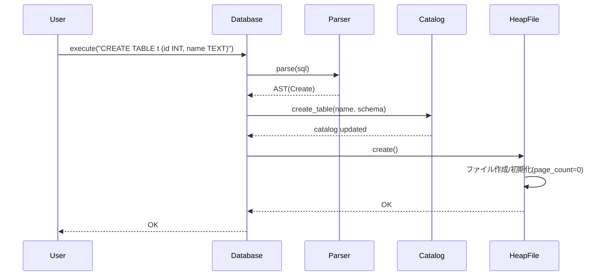
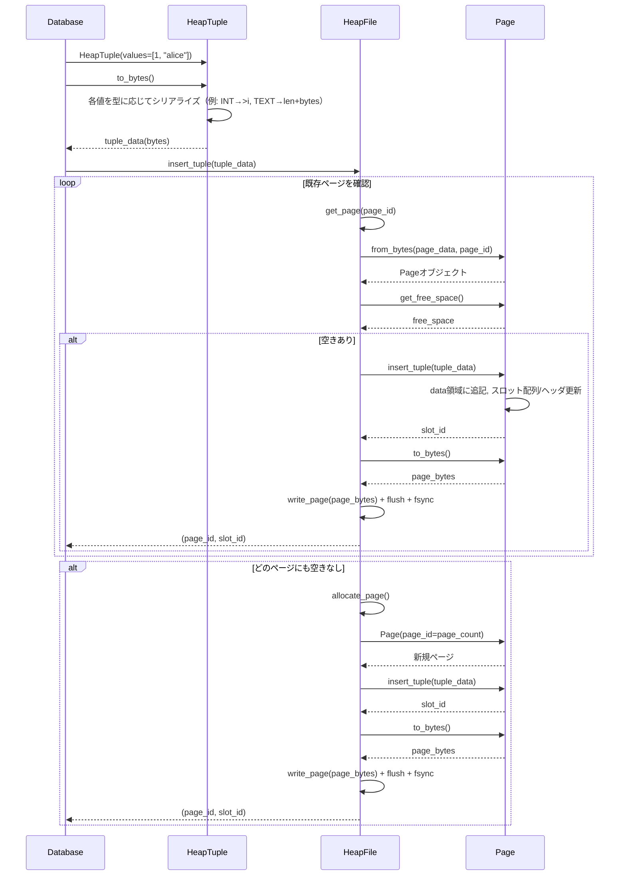
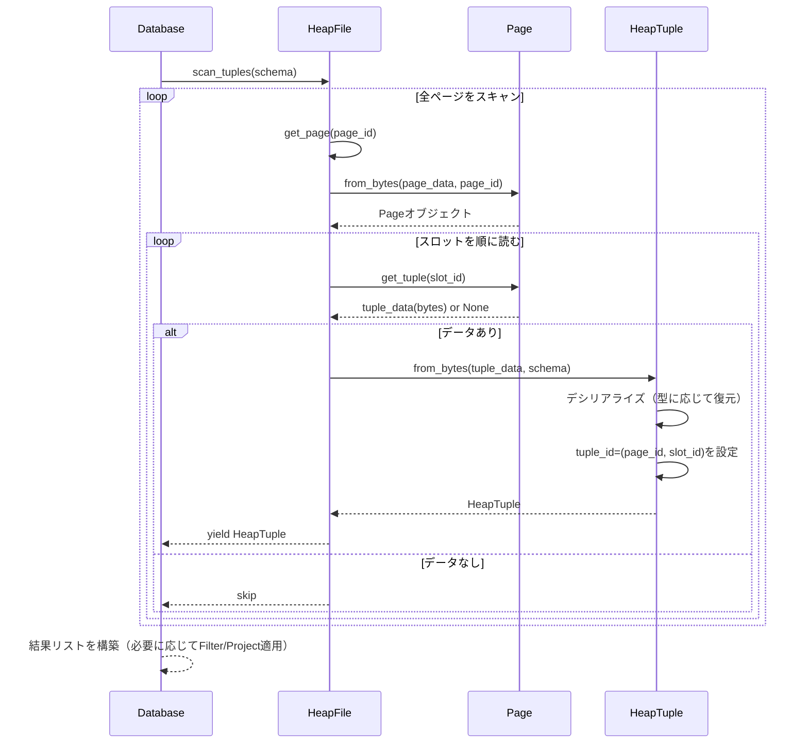

# フェーズ1: ストレージ層 詳細シーケンス図（create → insert → select）

本稿ではストレージ層を中心に, CREATE/SELECT/INSERT の詳細な呼び出し関係を時系列で示す。
主役は `HeapFile`, `Page`, `HeapTuple` であり, 必要に応じて `Database`, `Parser`, `Catalog` を登場させる。

---

## 1. CREATE TABLE（テーブル作成）

目的: カタログ登録とヒープファイルの物理作成。

要点:
- カタログと物理ファイルを同期して初期化する。
- まだページは割り当てない（`page_count=0`）。

---

## 2. INSERT（ストレージ層内の書き込みフロー）

目的: 値をシリアライズし, 空きのあるページへ格納。無ければ新規ページを割り当てる。

要点:
- 可変長タプルを「先頭から順配置」, スロット配列は「末尾から逆配置」。
- 書き込みは `write_page → flush → fsync` で永続化を保証（簡易実装）。

## 3. SELECT（ストレージ層内の読み取りフロー）

目的: 全ページ/全スロットをスキャンし, タプルをデシリアライズして返す。

要点:
- `get_page → Page.from_bytes` でページを復元してから, スロット配列経由でタプルを抽出。
- `HeapTuple.from_bytes` はスキーマの型情報に従い復元する。

---

## 付記: 役割分担の復習

- **HeapTuple**: 値⇔バイト列の相互変換（シリアライズ/デシリアライズ）と `tuple_id` の保持。
- **Page**: 8KB固定長ページ内での配置管理（データ領域/スロット配列/ヘッダ更新）。
- **HeapFile**: ページの読み書き・割当・全体スキャン, ディスクI/Oのトリガ。

この三者分業により, 「柔らかい可変長のレコード」を「堅牢な固定長ページ」に収め, ディスクI/Oを抑えつつ正しく永続化できる。

