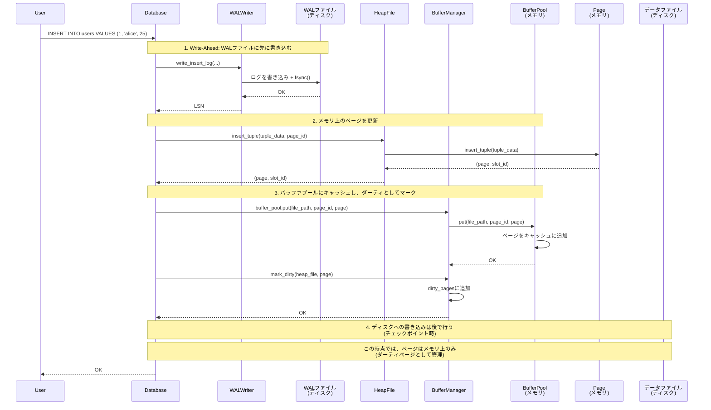
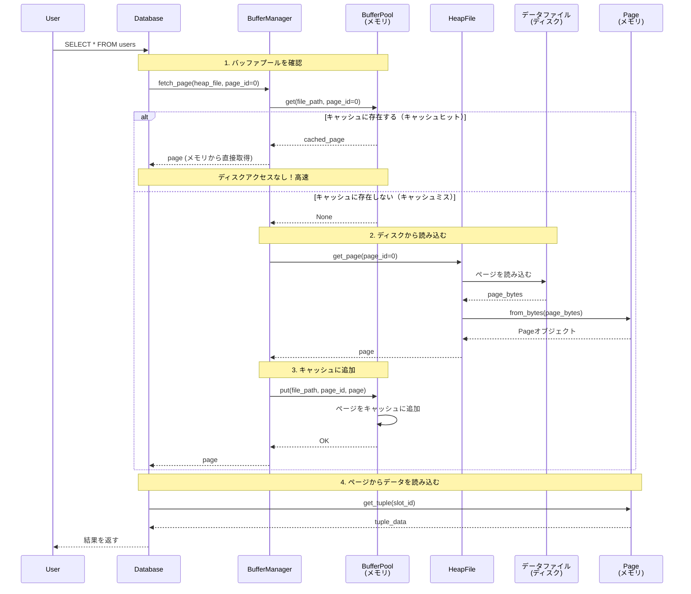
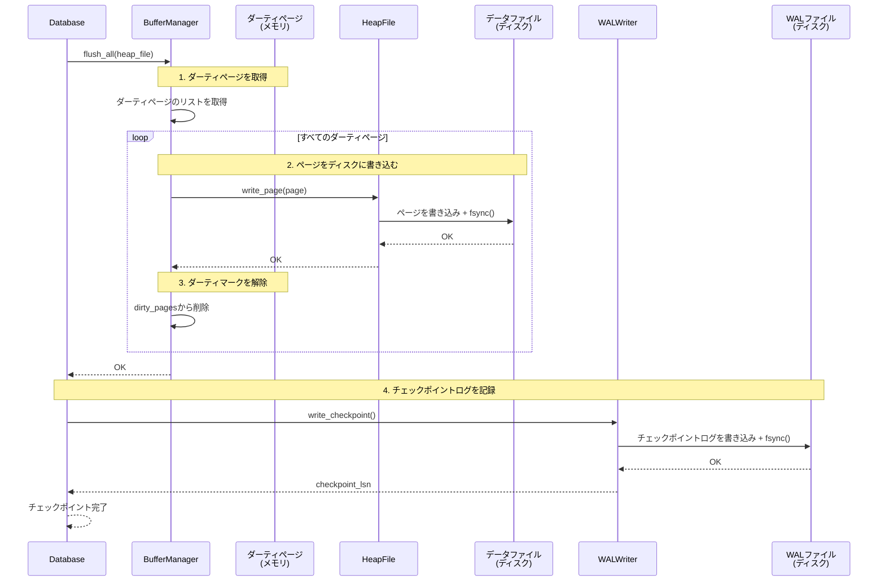

# フェーズ2: バッファマネージャー - データベースの「作業台」を作る

## はじめに

今回は、データベースのパフォーマンスを劇的に向上させる「バッファマネージャー」について語りましょう。

データベースのストレージ層が「倉庫」なら、バッファマネージャーは「作業台」です。倉庫から必要な道具を取り出して作業台に置いておけば、何度も倉庫に取りに行く必要がありません。データベースも同じで、頻繁にアクセスされるページをメモリに保持しておけば、ディスクへのアクセスを大幅に減らすことができます。

まるで、本を読む時に、よく使う辞書を机の上に置いておくようなものです。本棚に取りに行く必要がなくなり、読書の効率が上がります。バッファマネージャーは、まさにその「机の上」の役割を果たします。

## 何をやるのか：フェーズ2のバッファマネージャーの役割

### バッファマネージャーとは

バッファマネージャーは、ページキャッシュを管理し、ディスクI/Oを最適化する仕組みです。頻繁にアクセスされるページをメモリに保持することで、パフォーマンスを大幅に向上させます。

**ディスクI/Oはメモリアクセスの約10万倍遅い**

この事実が、バッファマネージャーの存在意義を物語っています。同じページを何度もディスクから読み込むのではなく、一度メモリに読み込んで、それを再利用することで、パフォーマンスを劇的に改善できます。

### フェーズ2で実装する範囲

フェーズ2では、バッファマネージャーの最小限の機能を実装します。具体的には、以下の3つの機能を実装します：

#### 1. バッファプール（BufferPool）

ページをキャッシュするメモリ領域です。固定サイズの辞書を使用して、ページをメモリに保持します。フェーズ2では、簡易的な実装として、容量に達したらすべてのページをクリアする方式を採用しています。

#### 2. ページの取得とキャッシュ（fetch_page）

ページを取得する際、まずバッファプールを確認します。キャッシュにない場合は、ディスクから読み込んでキャッシュに追加します。これにより、同じページへの2回目以降のアクセスは、ディスクアクセスなしで高速に処理できます。

#### 3. ダーティページの管理

変更されたページ（ダーティページ）を追跡し、チェックポイント時にまとめてディスクに書き込みます。これにより、Write-Ahead Loggingの原則に従い、WALに書き込んだ後にメモリ上のページを更新し、ディスクへの書き込みは後で行うことができます。

### フェーズ2で実装しない範囲

フェーズ2では、以下の機能は実装しません（将来の拡張として予定）：

- **LRU（Least Recently Used）アルゴリズム**: 使用頻度の低いページを自動的に削除する機能は将来の拡張
- **Clockアルゴリズム**: より効率的なページ置換アルゴリズムは将来の拡張
- **ピン/アンピン**: ページを固定して削除されないようにする機能は将来の拡張
- **統計情報**: キャッシュヒット率などの統計情報は将来の拡張
- **並行制御**: 複数のトランザクションからの同時アクセス制御はフェーズ4で実装

### バッファマネージャーの動作フロー

フェーズ2でのバッファマネージャーの動作を、簡単な例で説明しましょう：

1. **INSERT操作時**:
   - WALにログを書き込む
   - メモリ上のページを更新
   - ページをバッファプールにキャッシュし、ダーティとしてマーク

2. **SELECT操作時**:
   - バッファプールを確認
   - キャッシュにない場合は、ディスクから読み込んでキャッシュに追加
   - キャッシュにある場合は、メモリから直接読み込む

3. **チェックポイント時**:
   - すべてのダーティページをディスクに書き込む
   - ダーティページのマークを解除

この3つのステップにより、ディスクI/Oを最小限に抑えながら、データの整合性を保つことができます。

### バッファマネージャーとWALの協調

バッファマネージャーは、WALと密接に連携して動作します。以下、シーケンス図で詳しく説明します。

#### 1. INSERT操作時のバッファマネージャーの役割

INSERT操作では、WALに書き込んだ後、バッファマネージャーを使ってページを管理します。



**重要なポイント**:
- **WALファイル（ディスク）**: 先にログを書き込み、`fsync()`で確実に保存
- **バッファプール（メモリ）**: ページをキャッシュし、高速アクセスを可能にする
- **ダーティページ**: 変更されたページを追跡し、チェックポイント時にまとめて書き込む
- **データファイル（ディスク）**: この時点では書き込まない（チェックポイント時に書き込む）

#### 2. SELECT操作時のバッファマネージャーの役割

SELECT操作では、バッファプールを確認して、キャッシュからページを取得します。



**重要なポイント**:
- **キャッシュヒット**: メモリから直接読み込むため、非常に高速
- **キャッシュミス**: ディスクから読み込む必要があるが、次回以降はキャッシュから読み込める
- **自動キャッシュ**: 一度読み込んだページは自動的にキャッシュに追加される

#### 3. チェックポイント時のバッファマネージャーの役割

チェックポイント時には、すべてのダーティページをディスクに書き込みます。



**重要なポイント**:
- **ダーティページの一括書き込み**: すべての変更されたページをまとめて書き込む
- **WALとの協調**: ダーティページを書き込んだ後、チェックポイントログを記録
- **整合性の保証**: チェックポイント時点で、すべてのデータがディスクに保存されている

### まとめ：バッファマネージャーの役割

| 操作 | バッファプール（メモリ） | ダーティページ | データファイル（ディスク） |
|------|------------------------|---------------|------------------------|
| **INSERT操作時** | ページをキャッシュ | ダーティとしてマーク | 書き込まない |
| **SELECT操作時** | キャッシュから読み込む（ヒット時） | 変更なし | キャッシュミス時のみ読み込む |
| **チェックポイント時** | キャッシュは維持 | すべて書き込んでマーク解除 | **すべてのダーティページを書き込み** |

この3つのタイミングを理解することで、バッファマネージャーの動作を完全に把握できます。

## なぜやるのか：バッファマネージャーの存在意義

### 1. パフォーマンスの劇的な向上

データベースの最大のボトルネックは、ディスクI/Oです。ディスクアクセスはメモリアクセスの約10万倍遅いため、同じページを何度もディスクから読み込むのは非効率的です。

バッファマネージャーがあれば、一度読み込んだページをメモリに保持しておくことで、2回目以降のアクセスはメモリから直接読み込めます。これにより、パフォーマンスが劇的に向上します。

### 2. ディスクI/Oの削減

バッファマネージャーは、ディスクI/Oを大幅に削減します。例えば、同じページに10回アクセスする場合：

- **バッファマネージャーなし**: 10回のディスクアクセス
- **バッファマネージャーあり**: 1回のディスクアクセス（最初の1回のみ）+ 9回のメモリアクセス

この差は、データベースの規模が大きくなるほど顕著になります。

### 3. WALとの協調による整合性の保証

バッファマネージャーは、WALと密接に連携して動作します。Write-Ahead Loggingの原則に従い、WALに書き込んだ後にメモリ上のページを更新し、ディスクへの書き込みはチェックポイント時にまとめて行います。

これにより、パフォーマンスを向上させながら、データの整合性を保つことができます。

## 歴史的な背景：キャッシュ技術の進化

### 1960年代：コンピュータのメモリ階層の確立

1960年代、コンピュータのメモリ階層が確立されました。CPUに近いメモリほど高速ですが、容量が小さく、コストが高い。逆に、ディスクは容量が大きく、コストが低いですが、アクセス速度が遅い。

この階層構造を活用するため、頻繁にアクセスされるデータを高速なメモリに保持する「キャッシュ」の概念が生まれました。

### 1970年代：データベースシステムでのキャッシュの採用

1970年代、リレーショナルデータベースが登場した頃、ディスクI/Oが最大のボトルネックであることが明らかになりました。IBMのSystem RやIngresなどの初期のデータベースシステムでは、ページキャッシュを実装して、パフォーマンスを向上させました。

### 1980年代：バッファ置換アルゴリズムの研究

1980年代になると、限られたメモリ領域を効率的に使うため、バッファ置換アルゴリズムの研究が進みました。LRU（Least Recently Used）、Clock、2Qなどのアルゴリズムが提案され、それぞれの特性が研究されました。

### 1990年代：現代的なバッファマネージャーの確立

1990年代になると、PostgreSQLやMySQLなどの現代的なデータベースシステムで、バッファマネージャーが標準的な機能として確立されました。これらのシステムでは、バッファプールのサイズを調整できる設定が提供され、ユーザーが環境に応じて最適化できるようになりました。

### 現代のデータベースでの採用

バッファマネージャーは、現代の多くのデータベースシステムで採用されています：

- **PostgreSQL**: `shared_buffers`設定でバッファプールサイズを調整
- **MySQL (InnoDB)**: `innodb_buffer_pool_size`でバッファプールサイズを調整
- **Oracle**: `db_cache_size`でバッファプールサイズを調整

これらの実績により、バッファマネージャーは「データベースの標準的な機能」として確立されています。

## 技術的な詳細：バッファマネージャーの実装

### 1. バッファプール（BufferPool）の実装

バッファプールは、ページをキャッシュするメモリ領域です。フェーズ2では、簡易的な実装として、固定サイズの辞書を使用します。

```python
class BufferPool:
    """バッファプール
    
    ページをキャッシュするメモリ領域です。
    簡易的な実装として、固定サイズの辞書を使用します。
    将来的にはLRUやClockアルゴリズムによる置換を実装します。
    """
    
    def __init__(self, capacity: int = 100):
        """バッファプールを初期化
        
        Args:
            capacity: キャッシュできるページ数（デフォルト100ページ = 約800KB）
        """
        self.capacity = capacity
        self.pages: Dict[tuple[Path, int], Page] = {}  # (file_path, page_id) -> Page
        self.lock = threading.Lock()  # スレッドセーフティのため（将来の並行処理対応）
    
    def get(self, file_path: Path, page_id: int) -> Optional[Page]:
        """キャッシュからページを取得
        
        Args:
            file_path: ヒープファイルのパス
            page_id: ページID
            
        Returns:
            Pageオブジェクト（キャッシュにない場合はNone）
        """
        with self.lock:
            key = (file_path, page_id)
            return self.pages.get(key)
    
    def put(self, file_path: Path, page_id: int, page: Page):
        """ページをキャッシュに追加
        
        Args:
            file_path: ヒープファイルのパス
            page_id: ページID
            page: Pageオブジェクト
        """
        with self.lock:
            key = (file_path, page_id)
            
            # 容量制限チェック（簡易版: 最初に到達したらクリア）
            if len(self.pages) >= self.capacity:
                # 簡易的なクリア（将来はLRU等で置換）
                self.pages.clear()
            
            self.pages[key] = page
```

**重要なポイント**:
- **容量制限**: デフォルトで100ページ（約800KB）をキャッシュ
- **キーの設計**: `(file_path, page_id)`のタプルをキーとして使用
- **スレッドセーフティ**: 将来の並行処理対応のため、ロックを使用
- **簡易的な置換**: フェーズ2では、容量に達したらすべてのページをクリア（将来はLRU等で置換）

### 2. バッファマネージャー（BufferManager）の実装

バッファマネージャーは、バッファプールを管理し、ページの読み書きを最適化します。

```python
class BufferManager:
    """バッファマネージャ
    
    バッファプールを管理し、ページの読み書きを最適化します。
    ヒープファイルとバッファプールの間のインターフェースとして機能します。
    """
    
    def __init__(self, buffer_pool: Optional[BufferPool] = None):
        """バッファマネージャを初期化
        
        Args:
            buffer_pool: バッファプール（Noneの場合は新規作成）
        """
        self.buffer_pool = buffer_pool or BufferPool()
        self.dirty_pages: Dict[tuple[Path, int], Page] = {}  # ダーティページの追跡
    
    def fetch_page(self, heap_file: HeapFile, page_id: int) -> Page:
        """ページを取得（キャッシュ優先）
        
        Args:
            heap_file: ヒープファイル
            page_id: ページID
            
        Returns:
            Pageオブジェクト
        """
        # キャッシュを確認
        cached_page = self.buffer_pool.get(heap_file.file_path, page_id)
        if cached_page:
            return cached_page
        
        # キャッシュにない場合はディスクから読み込む
        page = heap_file.get_page(page_id)
        if page is None:
            raise ValueError(f"ページ {page_id} が存在しません")
        
        # キャッシュに追加
        self.buffer_pool.put(heap_file.file_path, page_id, page)
        return page
    
    def mark_dirty(self, heap_file: HeapFile, page: Page):
        """ページをダーティとしてマーク（変更済み）
        
        Args:
            heap_file: ヒープファイル
            page: 変更されたPageオブジェクト
        """
        key = (heap_file.file_path, page.page_id)
        self.dirty_pages[key] = page
    
    def flush_all(self, heap_file: HeapFile):
        """指定されたヒープファイルの全ダーティページをフラッシュ
        
        Args:
            heap_file: ヒープファイル
        """
        keys_to_flush = [
            key for key in self.dirty_pages.keys()
            if key[0] == heap_file.file_path
        ]
        
        for key in keys_to_flush:
            page = self.dirty_pages[key]
            self.flush_page(heap_file, page)
    
    def flush_page(self, heap_file: HeapFile, page: Page):
        """ページをディスクに書き込む
        
        Args:
            heap_file: ヒープファイル
            page: 書き込むPageオブジェクト
        """
        heap_file.write_page(page)
        key = (heap_file.file_path, page.page_id)
        self.dirty_pages.pop(key, None)
```

**重要なポイント**:
- **キャッシュ優先**: まずバッファプールを確認し、キャッシュにない場合のみディスクから読み込む
- **ダーティページの追跡**: 変更されたページを`dirty_pages`で追跡
- **一括フラッシュ**: チェックポイント時に、すべてのダーティページをまとめて書き込む

### 3. データベースクラスでの使用

データベースクラスでは、バッファマネージャーを初期化し、INSERT操作とチェックポイント時に使用します。

```python
class Database:
    def __init__(self, db_path: Optional[Path] = None):
        # ...
        # バッファマネージャを初期化
        self.buffer_manager = BufferManager()
        # ...
    
    def _execute_insert(self, stmt: InsertStatement) -> None:
        # ...
        # WALにログを書き込む（Write-Ahead）
        _lsn = self.wal_writer.write_insert_log(...)
        
        # WALへの書き込みが完了したら、メモリ上のページを更新
        page, actual_slot_id = heap_file.insert_tuple(tuple_data, page_id=page_id)
        
        # BufferManagerにページをキャッシュし、ダーティとしてマーク
        self.buffer_manager.buffer_pool.put(heap_file.file_path, page_id, page)
        self.buffer_manager.mark_dirty(heap_file, page)
        # ...
    
    def checkpoint(self) -> int:
        """チェックポイントを実行"""
        # BufferManagerのダーティページをすべて書き込む
        for table_name, heap_file in self.heap_files.items():
            self.buffer_manager.flush_all(heap_file)
        
        # チェックポイントを実行
        return self.checkpoint_manager.checkpoint(self.heap_files)
```

**重要なポイント**:
- **初期化**: データベース起動時にバッファマネージャーを初期化
- **INSERT操作**: WALに書き込んだ後、ページをバッファプールにキャッシュし、ダーティとしてマーク
- **チェックポイント**: すべてのダーティページを書き込んでから、チェックポイントログを記録

## 実装のポイント

### 1. キャッシュキーの設計

バッファプールでは、`(file_path, page_id)`のタプルをキーとして使用します。これにより、異なるテーブルの同じページIDでも、正しく区別できます。

```python
key = (file_path, page_id)
self.pages[key] = page
```

### 2. ダーティページの追跡

変更されたページは、`dirty_pages`辞書で追跡します。チェックポイント時に、この辞書に含まれるすべてのページをディスクに書き込みます。

```python
self.dirty_pages[key] = page
```

### 3. 簡易的な置換アルゴリズム

フェーズ2では、容量に達したらすべてのページをクリアする簡易的な実装を採用しています。将来的には、LRUやClockアルゴリズムによる置換を実装する予定です。

```python
if len(self.pages) >= self.capacity:
    # 簡易的なクリア（将来はLRU等で置換）
    self.pages.clear()
```

### 4. WALとの協調

バッファマネージャーは、WALと密接に連携して動作します。Write-Ahead Loggingの原則に従い、WALに書き込んだ後にメモリ上のページを更新し、ディスクへの書き込みはチェックポイント時にまとめて行います。

## まとめ

バッファマネージャーは、データベースのパフォーマンスを劇的に向上させる重要なコンポーネントです。

フェーズ2では、最小限の機能（バッファプール、ページの取得とキャッシュ、ダーティページの管理）を実装しますが、この基盤があれば、将来的に様々な機能（LRUアルゴリズム、統計情報、並行制御など）を追加することができます。

バッファマネージャーという1960年代から確立された技術を、現代のデータベースエンジン開発に応用する。これこそが、エンジニアとしての基礎力を身につける最良の方法です。

データベースエンジンを開発する上で、バッファマネージャーは欠かせない技術です。ディスクI/Oという現実的な問題に対して、確実な解決策を提供します。この技術を理解することで、データベースの「パフォーマンス」という根本的な課題に取り組むことができます。

次回は、インデックスについて語りましょう。それでは、良いコーディングライフを！

