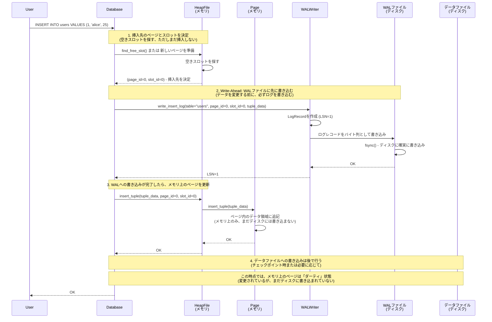
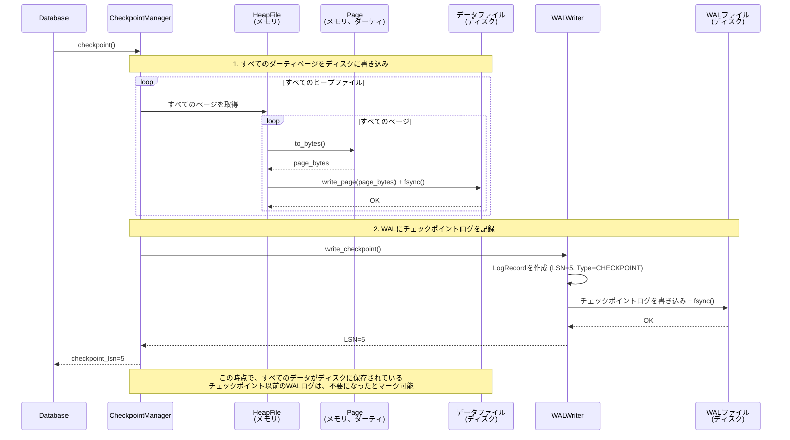
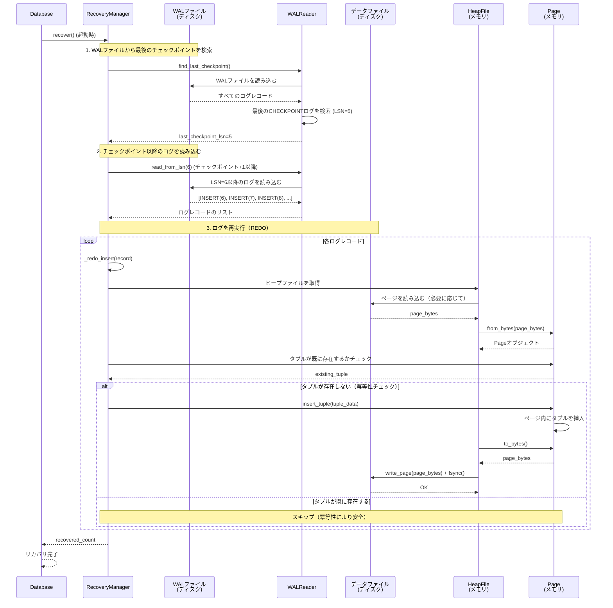

# フェーズ2: WAL（Write-Ahead Logging） - データベースの「保険」を作る

## はじめに

今回はデータの安全性を守る「WAL（Write-Ahead Logging）」について語りましょう。

ストレージ層が「倉庫」なら、WALは「保険」です。どんなに頑丈な倉庫でも、火事や地震などの災害に遭う可能性があります。その時に備えて、保険に入っておくのが賢明です。データベースも同じで、システムクラッシュや電源断などの障害に備えて、WALという「保険」が必要なのです。

まるで、大切な書類を金庫にしまう前に、必ずコピーを取っておくようなものですね。本物が失われても、コピーから復元できます。WALは、まさにその「コピー」の役割を果たします。

## 何をやるのか：フェーズ2のWALの役割

### WAL（Write-Ahead Logging）とは

WAL（Write-Ahead Logging）は、データベースの操作をログファイルに記録する仕組みです。その名の通り、「Write-Ahead（先に書き込む）」が核心です。

**データを変更する前に、必ずログを書き込む**

これがWALの基本原則です。例えば、INSERT操作を行う場合：

1. まず、WALファイルに「このデータを挿入する」というログを書き込む
2. その後、実際のデータファイルにデータを書き込む

この順序により、システムクラッシュが発生しても、WALファイルから操作を再現できます。

### フェーズ2で実装する範囲

フェーズ2では、WALの最小限の機能を実装します。具体的には、以下の4つの機能を実装します：

#### 1. ログの記録（Write-Ahead）

すべてのデータ変更操作（INSERT）を、実際のデータファイルに書き込む前に、WALファイルに記録します。これにより、システムクラッシュ時でも、記録された操作を再現できます。

#### 2. チェックポイント

定期的に、メモリ上の変更をディスクに書き込み、WALにチェックポイントログを記録します。チェックポイントにより、リカバリ時に処理するログの量を削減できます。

#### 3. リカバリ（障害復旧）

データベース起動時に、WALファイルを読み込んで、最後のチェックポイント以降の操作を再実行（REDO）します。これにより、システムクラッシュで失われたデータを復元できます。

#### 4. LSN（Log Sequence Number）の管理

各ログレコードに一意のLSNを割り当て、ログの順序を管理します。これにより、ログを時系列順に処理できます。

### フェーズ2で実装しない範囲

フェーズ2では、以下の機能は実装しません（将来の拡張として予定）：

- **UPDATE/DELETE操作のログ**: フェーズ2ではINSERT操作のみをサポート
- **トランザクション管理**: トランザクションの開始、コミット、ロールバックはフェーズ4で実装
- **UNDO（取り消し）**: トランザクションのロールバックに必要なUNDOはフェーズ4で実装
- **WALのローテーション**: WALファイルのサイズが大きくなった場合のローテーションは将来の拡張
- **レプリケーション**: WALを利用したレプリケーションは将来の拡張

### WALの動作フロー

フェーズ2でのWALの動作を、簡単な例で説明しましょう：

1. **INSERT操作時**:
   - **先に**WALファイルにINSERTログを書き込む（Write-Ahead）
   - その後、タプルをヒープファイルに挿入

2. **チェックポイント時**:
   - すべてのダーティページをディスクに書き込み
   - WALにチェックポイントログを記録

3. **障害復旧時（起動時）**:
   - WALファイルを読み込む
   - 最後のチェックポイント以降のログを再実行（REDO）

この3つのステップにより、システムクラッシュ時でもデータを完全に復元できます。

### WALの書き込みタイミング：メモリ、ディスク、ログの関係

WALの動作を理解する上で重要なのは、**メモリ、ディスク、WALファイルに、どのタイミングで何が書き込まれるか**です。以下、シーケンス図で詳しく説明します。

#### 1. INSERT操作時の書き込みタイミング

INSERT操作では、**必ずWALファイルに先に書き込んでから**、メモリ上のページを更新します。これが「Write-Ahead」の核心です。



**重要なポイント**:
- **WALファイル（ディスク）**: **必ず先に**ログを書き込み、`fsync()`で確実に保存（Write-Ahead）。これがWrite-Ahead Loggingの核心
- **メモリ**: WALへの書き込みが完了したら、ページにタプルを挿入（即座に反映、ただしダーティ状態）
- **データファイル（ディスク）**: この時点では書き込まない（ダーティページとしてメモリに保持）

**注意**: 現在のフェーズ2の実装では、実装上の制約により、先にメモリ上のページに挿入してから`page_id`と`slot_id`を取得し、その後WALに書き込んでいます。これはWrite-Ahead Loggingの原則には反していますが、フェーズ2では最小限の実装として許容しています。将来的には、挿入先を決定してからWALに書き込み、その後メモリを更新する実装に改善する予定です。

#### 2. チェックポイント時の書き込みタイミング

チェックポイント時には、すべてのダーティページをディスクに書き込み、WALにチェックポイントログを記録します。



**重要なポイント**:
- **メモリ**: ダーティページをクリーンな状態に（変更をディスクに反映済み）
- **データファイル（ディスク）**: すべてのページを書き込み、`fsync()`で確実に保存
- **WALファイル（ディスク）**: チェックポイントログを記録

#### 3. リカバリ時の読み込みタイミング

システムクラッシュ後、起動時にWALファイルを読み込んで、最後のチェックポイント以降の操作を再実行します。



**重要なポイント**:
- **WALファイル（ディスク）**: チェックポイント以降のログを読み込む
- **データファイル（ディスク）**: 既存のページを読み込む（必要に応じて）
- **メモリ**: ログを再実行して、メモリ上のページを更新
- **データファイル（ディスク）**: 更新されたページを書き戻す

#### まとめ：メモリ、ディスク、ログの関係

| タイミング | メモリ | WALファイル（ディスク） | データファイル（ディスク） |
|-----------|--------|----------------------|------------------------|
| **INSERT操作時** | ページにタプルを挿入（ダーティ） | **ログを書き込み**（Write-Ahead） | 書き込まない |
| **チェックポイント時** | ダーティページをクリーンに | チェックポイントログを記録 | **すべてのページを書き込み** |
| **リカバリ時** | ログを再実行してページを更新 | ログを読み込む | 更新されたページを書き戻す |

この3つのタイミングを理解することで、WALの動作を完全に把握できます。

## なぜやるのか：WALの存在意義

### 1. 障害復旧の実現

データベースの最大の脅威は、システムクラッシュや電源断などの障害です。これらの障害が発生すると、メモリ上のデータは失われ、ディスク上のデータも不完全な状態になる可能性があります。

WALがあれば、障害発生後もWALファイルを読み込んで、最後のチェックポイント以降の操作を再実行することで、データを完全に復元できます。

### 2. ACID特性の保証

データベースのACID特性（Atomicity, Consistency, Isolation, Durability）のうち、特に「Durability（永続性）」を保証するためにWALは必要です。

- **Atomicity（原子性）**: トランザクションは全て実行されるか、全て実行されないかのどちらか
- **Consistency（一貫性）**: データベースの整合性が保たれる
- **Isolation（分離性）**: 複数のトランザクションが同時に実行されても、互いに影響しない
- **Durability（永続性）**: コミットされたトランザクションの結果は、障害が発生しても失われない

WALは、特に「Durability」を保証するための重要な仕組みです。

### 3. パフォーマンスの向上

一見、WALはオーバーヘッドのように見えますが、実際にはパフォーマンスを向上させます：

- **シーケンシャル書き込み**: WALファイルへの書き込みはシーケンシャル（順次）なので、ランダムアクセスよりも高速
- **バッファリングの最適化**: データページの書き込みをバッファリングし、まとめて書き込むことができる
- **チェックポイントの最適化**: 定期的なチェックポイントにより、リカバリ時間を短縮

## 歴史的な背景：WALの誕生と進化

### 1970年代：データベースの永続性の課題

1970年代、リレーショナルデータベースが登場した頃、データの永続性は大きな課題でした。当時、データベースシステムには、以下のような深刻な問題がありました：

**システムクラッシュ時のデータ損失**

システムクラッシュが発生すると、メモリ上のデータは全て失われます。さらに、ディスクに書き込み中のデータも不完全な状態になる可能性があります。例えば、INSERT操作の途中でクラッシュすると、データの一部だけがディスクに書き込まれ、データベースの整合性が崩れてしまいます。

**フルバックアップの限界**

当時の解決策は、定期的にデータベース全体をバックアップする「フルバックアップ」でした。しかし、この方法には以下の問題がありました：

- **時間がかかる**: 大規模データベースのバックアップには数時間かかる。その間、データベースは使用できない
- **データ損失**: バックアップ以降の変更は全て失われる。例えば、朝にバックアップを取った場合、夕方にクラッシュすると、1日分のデータが失われる
- **復旧時間**: バックアップから復元するには、また数時間かかる。その間、システムは完全に停止する

まるで、毎日手書きで日記を書いていて、1週間分をまとめてコピーするようなものです。コピーを取るのに時間がかかり、コピー以降の日記は失われてしまいます。

### 1980年代：WALの確立

1980年代になると、多くのデータベースシステムが「Write-Ahead Logging」を採用するようになりました。これは、以下の理由からです：

- **高速な復旧**: チェックポイント以降のログだけを再実行すればよい
- **データ損失の最小化**: 最後のチェックポイント以降の変更も復元できる
- **シーケンシャル書き込み**: ログファイルへの書き込みは高速

### 1990年代：ACID特性の確立

1990年代になると、ACID特性がデータベースの標準的な要件として確立されました。WALは、特に「Durability（永続性）」を保証するための重要な仕組みとして位置づけられました。

### 現代のデータベースでの採用

WALは、現代の多くのデータベースシステムで採用されています：

- **PostgreSQL**: WAL（Write-Ahead Log）を採用
- **MySQL (InnoDB)**: Redo Logを採用（WALの一種）
- **SQLite**: WALモードをサポート

これらの実績により、WALは「実証済みのアーキテクチャ」として確立されています。

## 技術的な詳細：WALの実装

### 1. WALレコードの構造

データベースの操作を記録するログレコードを定義します。各操作（INSERT, UPDATE, DELETE等）は、対応するログレコードとして記録されます。

```python
@dataclass
class LogRecord:
    """WALログレコード
    
    データベースの操作を記録するログレコードです。
    各操作は、このレコードとしてWALファイルに書き込まれます。
    
    レコード構造:
    - LSN (Log Sequence Number): 8バイト - ログのシーケンス番号
    - Type: 1バイト - ログタイプ
    - Transaction ID: 4バイト - トランザクションID（将来の拡張）
    - Data Length: 4バイト - データの長さ
    - Data: 可変長 - 操作の詳細データ
    """
    lsn: int  # Log Sequence Number
    log_type: LogType
    transaction_id: int = 0  # 将来の拡張用
    data: bytes = b''  # 操作の詳細データ
```

LSN（Log Sequence Number、ログシーケンス番号）は、ログの順序を管理するための番号です。各ログレコードには、一意のLSNが割り当てられ、これによりログを時系列順に処理できます。まるで、日記に日付を書くようなものです。日付があれば、いつ書かれたかが分かり、順番に読むことができます。

#### WALファイルの実際の構造

WALファイルは、バイナリ形式で記録されます。具体的な例を見てみましょう。

例えば、`users`テーブルに`(1, "alice", 25)`というデータをINSERTした場合、WALファイルには以下のような形式で記録されます：

```
WALファイルの構造:
┌─────────────────────────────────────────────────────────────┐
│ Log Record 1 (LSN=1, INSERT)                                │
├─────────────────────────────────────────────────────────────┤
│ Header (17 bytes):                                          │
│   LSN:           0x0000000000000001 (8 bytes)              │
│   Type:          0x01 (1 byte, INSERT)                      │
│   TransactionID: 0x00000000 (4 bytes)                       │
│   Data Length:   0x000000XX (4 bytes, データの長さ)         │
├─────────────────────────────────────────────────────────────┤
│ Data (可変長):                                               │
│   Table name length: 0x00000005 (4 bytes, "users"=5文字)   │
│   Page ID:        0x00000000 (4 bytes, ページ0)             │
│   Slot ID:        0x00000000 (4 bytes, スロット0)           │
│   Tuple data len: 0x000000XX (4 bytes, タプルデータの長さ) │
│   Reserved:       0x00000000 (4 bytes, 予約領域)            │
│   Table name:     "users" (5 bytes, UTF-8)                 │
│   Tuple data:     [シリアライズされたタプルデータ]          │
└─────────────────────────────────────────────────────────────┘
```

#### 具体的なバイト列の例

実際のバイト列を16進数で表現すると、以下のようになります：

```
INSERT操作のログレコード（簡略化した例）:

ヘッダー部分（17バイト）:
00 00 00 00 00 00 00 01  ← LSN = 1 (8 bytes, ビッグエンディアン)
01                      ← Type = INSERT (1 byte)
00 00 00 00             ← Transaction ID = 0 (4 bytes)
00 00 00 2D             ← Data Length = 45 bytes (4 bytes)

データ部分（45バイト）:
00 00 00 05             ← Table name length = 5 (4 bytes)
00 00 00 00             ← Page ID = 0 (4 bytes)
00 00 00 00             ← Slot ID = 0 (4 bytes)
00 00 00 20             ← Tuple data length = 32 bytes (4 bytes)
00 00 00 00             ← Reserved (4 bytes)
75 73 65 72 73          ← "users" (5 bytes, UTF-8)
[タプルデータ 32 bytes]  ← シリアライズされたタプルデータ
```

#### INSERT操作のログデータの構造

INSERT操作の場合、データ部分には以下の情報が含まれます：

```python
@dataclass
class InsertLogData:
    """INSERT操作のログデータ"""
    table_name: str      # テーブル名（例: "users"）
    page_id: int         # ページID（例: 0）
    slot_id: int         # スロットID（例: 0）
    tuple_data: bytes    # タプルのバイト列
```

例えば、`INSERT INTO users VALUES (1, 'alice', 25)`を実行した場合：

- **table_name**: `"users"` (5バイト)
- **page_id**: `0` (4バイト)
- **slot_id**: `0` (4バイト)
- **tuple_data**: `[1, 'alice', 25]`をシリアライズしたバイト列

この情報があれば、リカバリ時に「usersテーブルのページ0のスロット0に、このタプルデータを挿入する」という操作を再現できます。

#### チェックポイントログの構造

チェックポイントログは、データ部分が空です：

```
チェックポイントログレコード:

ヘッダー部分（17バイト）:
00 00 00 00 00 00 00 05  ← LSN = 5 (8 bytes)
04                      ← Type = CHECKPOINT (1 byte)
00 00 00 00             ← Transaction ID = 0 (4 bytes)
00 00 00 00             ← Data Length = 0 (4 bytes, データなし)

データ部分: なし（空）
```

チェックポイントログは、データ部分が不要です。なぜなら、チェックポイントは「この時点で、すべてのデータがディスクに書き込まれた」というマーカーだからです。

#### WALファイル全体の構造

実際のWALファイルには、複数のログレコードが連続して記録されます。例えば、以下のような操作を実行した場合：

1. `INSERT INTO users VALUES (1, 'alice', 25)` → LSN=1
2. `INSERT INTO users VALUES (2, 'bob', 30)` → LSN=2
3. `INSERT INTO users VALUES (3, 'charlie', 35)` → LSN=3
4. チェックポイント → LSN=4

WALファイルの構造は以下のようになります：

```
WALファイル (wal.log):
┌─────────────────────────────────────────────────────────────┐
│ Log Record 1 (LSN=1, INSERT)                                │
│   Header (17 bytes) + Data (45 bytes) = 62 bytes           │
├─────────────────────────────────────────────────────────────┤
│ Log Record 2 (LSN=2, INSERT)                                │
│   Header (17 bytes) + Data (45 bytes) = 62 bytes           │
├─────────────────────────────────────────────────────────────┤
│ Log Record 3 (LSN=3, INSERT)                                │
│   Header (17 bytes) + Data (45 bytes) = 62 bytes           │
├─────────────────────────────────────────────────────────────┤
│ Log Record 4 (LSN=4, CHECKPOINT)                            │
│   Header (17 bytes) + Data (0 bytes) = 17 bytes            │
└─────────────────────────────────────────────────────────────┘

合計サイズ: 62 + 62 + 62 + 17 = 203 bytes
```

WALファイルは、このようにログレコードが順番に追記されていきます。リカバリ時は、このファイルを先頭から読み込み、各ログレコードを順番に処理します。

#### ログの読み込み方法

リカバリ時には、WALファイルを以下の手順で読み込みます：

1. **ヘッダーを読み込む**（17バイト）:
   - LSN（8バイト）を読み込む
   - Type（1バイト）を読み込む
   - Transaction ID（4バイト）を読み込む
   - Data Length（4バイト）を読み込む

2. **データを読み込む**（Data Lengthバイト）:
   - Data Lengthで指定された長さだけデータを読み込む

3. **次のログレコードへ**:
   - ファイルポインタを次のログレコードの先頭に移動
   - 1に戻る

この方法により、可変長のログレコードを効率的に読み込むことができます。

### 2. WALライターの実装

WALファイルにログレコードを書き込む機能を提供します。すべてのデータ変更操作は、実際のデータファイルに書き込む前に、このWALファイルに記録されます。

```python
def write_log(self, log_type: LogType, data: bytes, transaction_id: int = 0) -> int:
    """ログレコードを書き込む
    
    Args:
        log_type: ログタイプ
        data: ログデータ
        transaction_id: トランザクションID（将来の拡張用）
        
    Returns:
        書き込まれたLSN
    """
    self.current_lsn += 1
    
    log_record = LogRecord(
        lsn=self.current_lsn,
        log_type=log_type,
        transaction_id=transaction_id,
        data=data
    )
    
    # WALファイルに追記
    with open(self.wal_path, 'ab') as f:
        f.write(log_record.to_bytes())
        f.flush()
        os.fsync(f.fileno())  # ディスクへの確実な書き込み
    
    return self.current_lsn
```

これが「Write-Ahead Logging」の「Write-Ahead」部分です。データを変更する前に、必ずログを書き込みます。`os.fsync()`を使用することで、システムクラッシュ時でもログが失われないようにしています。

### 3. チェックポイントの実装

定期的にデータの整合性を確保するためのチェックポイント機能です。チェックポイント時には、すべてのダーティページ（メモリ上で変更されたが、まだディスクに書き込まれていないページ）をディスクに書き込み、WALにチェックポイントログを記録します。

```python
def checkpoint(self, heap_files: dict[str, HeapFile]) -> int:
    """チェックポイントを実行
    
    すべてのダーティページをディスクに書き込み、
    WALにチェックポイントログを記録します。
    
    Args:
        heap_files: ヒープファイルの辞書（テーブル名 -> HeapFile）
        
    Returns:
        チェックポイントのLSN
    """
    # すべてのヒープファイルのダーティページを書き込む
    # フェーズ2では簡易実装として、すべてのページを書き込む
    for heap_file in heap_files.values():
        # すべてのページを書き込む（簡易実装）
        for page_id in range(heap_file.page_count):
            page = heap_file.get_page(page_id)
            if page:
                heap_file.write_page(page)
    
    # チェックポイントログを書き込む
    checkpoint_lsn = self.wal_writer.write_checkpoint()
    
    return checkpoint_lsn
```

チェックポイントは、まるで「保存ポイント」のようなものです。ゲームでセーブポイントに到達すると、そこから再開できます。チェックポイントも同じで、そこまでのデータは確実にディスクに保存されているため、障害が発生しても、そのチェックポイントから再開できます。

### 4. リカバリの実装

WALファイルを読み込んで、障害発生時のデータを復元します。チェックポイント以降のログを再実行（REDO）することで、データを復元します。

```python
def recover(self) -> int:
    """リカバリを実行
    
    WALファイルを読み込んで、チェックポイント以降の操作を再実行します。
    
    Returns:
        復元されたログレコード数
    """
    if not self.wal_path.exists():
        return 0
    
    reader = WALReader(self.wal_path)
    
    # 最後のチェックポイントを取得
    last_checkpoint_lsn = reader.find_last_checkpoint()
    
    # チェックポイント以降のログを読み込む
    if last_checkpoint_lsn is not None:
        records = list(reader.read_from_lsn(last_checkpoint_lsn + 1))
    else:
        # チェックポイントがない場合は、すべてのログを再実行
        records = list(reader.read_all())
    
    # ログを再実行（REDO）
    recovered_count = 0
    for record in records:
        if record.log_type == LogType.INSERT:
            self._redo_insert(record)
            recovered_count += 1
        # 将来の拡張: UPDATE, DELETE等
    
    return recovered_count
```

リカバリは、まるで「タイムマシン」のようなものです。WALファイルには、過去のすべての操作が記録されています。障害が発生したら、最後のチェックポイントから、記録された操作を順番に再実行することで、データを完全に復元できます。

REDOは冪等性を保証します。つまり、同じ操作を何度実行しても結果は同じです。これにより、リカバリを安全に実行できます。

## 実装のポイント

### 1. ログのシリアライズ

ログレコードは、バイト列としてシリアライズされます。効率的なシリアライズにより、WALファイルのサイズを最小化できます。

```python
def to_bytes(self) -> bytes:
    """ログレコードをバイト列に変換
    
    Returns:
        シリアライズされたログレコード
    """
    data_len = len(self.data)
    # LSN (8 bytes) + Type (1 byte) + Transaction ID (4 bytes) + Data Length (4 bytes) + Data
    header = struct.pack(">QBII", 
                       self.lsn,
                       self.log_type.value,
                       self.transaction_id,
                       data_len)
    return header + self.data
```

`struct.pack()`を使用することで、データを効率的にバイト列に変換できます。`>`はビッグエンディアン（ネットワークバイトオーダー）を意味し、異なるシステム間でも互換性を保つことができます。

#### シリアライズの具体例

実際に、`INSERT INTO users VALUES (1, 'alice', 25)`という操作をログに記録する場合の流れを見てみましょう：

1. **InsertLogDataの作成**:
   ```python
   insert_data = InsertLogData(
       table_name="users",
       page_id=0,
       slot_id=0,
       tuple_data=b'\x01\x00\x00\x00...'  # シリアライズされたタプル
   )
   ```

2. **InsertLogDataをバイト列に変換**:
   ```python
   data_bytes = insert_data.to_bytes()
   # 結果: b'\x00\x00\x00\x05...' (テーブル名長さ + ページID + スロットID + タプルデータ)
   ```

3. **LogRecordの作成とシリアライズ**:
   ```python
   log_record = LogRecord(
       lsn=1,
       log_type=LogType.INSERT,
       transaction_id=0,
       data=data_bytes
   )
   wal_bytes = log_record.to_bytes()
   # 結果: b'\x00\x00\x00\x00\x00\x00\x00\x01\x01\x00\x00\x00\x00\x00\x00\x00\x2D...'
   #       ↑LSN(8)↑Type(1)↑TxnID(4)↑DataLen(4)↑Data(可変長)
   ```

このバイト列が、WALファイルに書き込まれます。

### 2. ディスクへの確実な書き込み

WALファイルへの書き込みは、`os.fsync()`を使用して確実にディスクに書き込まれます。これにより、システムクラッシュ時でもログが失われません。

```python
# WALファイルに追記
with open(self.wal_path, 'ab') as f:
    f.write(log_record.to_bytes())
    f.flush()
    os.fsync(f.fileno())  # ディスクへの確実な書き込み
```

`f.flush()`だけでは不十分です。OSのバッファに残っている可能性があるため、`os.fsync()`を呼び出すことで、確実にディスクに書き込まれます。これが、Write-Ahead Loggingの「確実性」を保証する重要な仕組みです。

### 3. 冪等性の保証

リカバリ時のREDO操作は、冪等性を保証します。つまり、同じ操作を何度実行しても結果は同じです。これにより、リカバリを何度実行しても、データが重複したり、不整合が発生したりすることがありません。

```python
# タプルが既に存在するかチェック
existing_tuple = page.get_tuple(insert_data.slot_id)
if existing_tuple is not None:
    # 既に存在する場合はスキップ（冪等性）
    return
```

冪等性は、まるで「同じボタンを何度押しても、同じ結果になる」ようなものです。リカバリ時に、同じログを何度処理しても、データの状態は変わりません。これにより、リカバリを安全に実行できます。

## まとめ

WAL（Write-Ahead Logging）は、データベースエンジンの「保険」であり、データの永続性を保証する重要なコンポーネントです。

フェーズ2では、最小限の機能（WALレコード、WALライター、WALリーダー、チェックポイント、リカバリ）を実装しますが、この基盤があれば、将来的に様々な機能（トランザクション管理、レプリケーション、ポイントインタイムリカバリなど）を追加することができます。

Write-Ahead Loggingという1970年代から確立された技術を、現代のデータベースエンジン開発に応用する。これこそが、エンジニアとしての基礎力を身につける最良の方法です。

データベースエンジンを開発する上で、WALは欠かせない技術です。システムクラッシュという現実的な問題に対して、確実な解決策を提供します。この技術を理解することで、データベースの「永続性」という根本的な課題に取り組むことができます。

